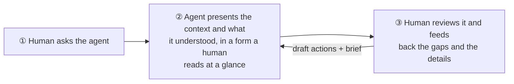

# dev-process-kit

[](https://www.npmjs.com/package/dev-process-kit)
[](https://www.npmjs.com/package/dev-process-kit?activeTab=versions)
[](https://www.jsdelivr.com/package/npm/dev-process-kit)
[](https://github.com/d-kimuson/dev-process-kit/actions/workflows/ci.yml)
[](https://d-kimuson.github.io/dev-process-kit/)
[](LICENSE)
<br />
[](docs/index.md)
[](skills/dev-process-kit/SKILL.md)
[](#install-the-skill)

Design-process documents as single HTML files: an agent generates one, a human reviews it in the
browser, and the review comes back as structured change requests the agent can apply.

## Features

- **Rich diagrams with almost no code.** Parts for the traditional diagrams a development process uses, ready to drop into your markup.
- **No setup.** The components are made for a single-file HTML page and ship as Web Components: one `<script>` tag, and they are there.
- **Feedback without leaving the page.** Operate the diagram and comment on individual elements in the UI, then copy the operations and the comments out as a hand-off to an agent.
- **First-class support for Claude Artifacts.** Published from Claude Code as a Claude Artifact, the page follows the claude.ai theme and sends the review straight back to the Claude session with one click: no copy and paste.

## Why dev-process-kit?

Now that AI writes the code, the bottleneck has moved to the human side: the cognitive load of reading, checking and agreeing on what was built. dev-process-kit supports that human context engineering.

It does so with one consistent loop:



② is why the kit ships the formats that have proven themselves for building shared understanding between human engineers — user story mapping, ER diagrams and the rest.

③ goes further than showing a picture: where a format allows it, the page can be operated directly in the browser, and those operations are collected as a log and handed to the agent, which rewrites the page itself.

## Usage

dev-process-kit is built to be used by an agent: the instructions for LLMs are the [`dev-process-kit` skill](skills/dev-process-kit/SKILL.md). It is published to npm as [`dev-process-kit`](https://www.npmjs.com/package/dev-process-kit), a page loads it from jsDelivr with the version pinned, and the documentation of each version is [`docs/`](docs/index.md) at its `v<version>` tag.

The samples of `main` are live at https://d-kimuson.github.io/dev-process-kit/.

The shortest way to try it is to hand the skill to an agent and say what you want:

```markdown
Create a USM for this product.
Follow https://raw.githubusercontent.com/d-kimuson/dev-process-kit/main/skills/dev-process-kit/SKILL.md.
```

### Claude Artifacts

Claude Code can publish the page as a Claude Artifact instead of a local file, and dev-process-kit supports that as a first-class target:

- **One-click hand-off.** With the `comments` and `db` capabilities declared, the review rail offers **Send to Claude** in place of copying. The review arrives in the Claude Code session that published the page, which applies it and republishes to the same URL.
- **Fits the viewer.** The template follows the reader's claude.ai light / dark theme and sizes itself to the viewer's frame.
- **Nothing to configure.** The page detects the Artifact at runtime; outside one, or when a send cannot land, the copy hand-off stays as it is.

The skill's [Claude Artifact reference](skills/dev-process-kit/references/claude-artifact.md) tells the agent how to write and publish such a page.

### Install the skill

The `dev-process-kit` agent skill tells the agent when to reach for a page and how to keep it focused.

```sh
# Any agent supported by the skills CLI
npx skills add d-kimuson/dev-process-kit
```

```text
# Claude Code
/plugin marketplace add d-kimuson/dev-process-kit
/plugin install dev-process-kit@dev-process-kit
```

## Supported components

dev-process-kit ships **templates**, which make up a whole page, and **components**, which you combine inside one.

### Templates

| Template           | Element                        | What it is                                                                                                                                                       |
| ------------------ | ------------------------------ | ---------------------------------------------------------------------------------------------------------------------------------------------------------------- |
| UX Prototype       | `dpk-template-prototype`       | `Activity › UserStory › Step › Preview[]`: one step is one page or experience state, with previews per viewport                                                  |
| User Story Mapping | `dpk-template-usm`             | The backbone (activity › step) as columns, milestones as rows                                                                                                    |
| Event Storming     | `dpk-template-event-storming`  | Sticky notes on swimlanes in timeline order, with causality links between them                                                                                   |
| Example Mapping    | `dpk-template-example-mapping` | One story per column, rules beneath it, examples beneath each rule, questions pinned to any of them                                                              |
| Grill              | `dpk-template-grill`           | A review of questions over whatever you put in the main area: the questions are base data, the answers are draft actions, the badges sit on your own markup      |
| Plain              | `dpk-template-plain`           | For a page no other template fits: only the header and the review (comments) pipeline around your own markup                                                     |
| Slides             | `dpk-template-slides`          | A slide deck for explaining something step by step: slide titles and points are base data, richer bodies are your own markup, comments go on the slide on screen |

### Components

| Component        | Element                          | What it is                                                                                   |
| ---------------- | -------------------------------- | -------------------------------------------------------------------------------------------- |
| Review rail      | `dpk-component-comment-panel`    | Draft actions and comments, stale markers, deletion, and the copy or send-to-Claude hand-off |
| Inline editing   | `dpk-component-inline-edit`      | A text/multiline editor that emits `dpk-commit`                                              |
| State diagram    | `dpk-component-state-diagram`    | Which states exist, and what moves between them                                              |
| Sequence diagram | `dpk-component-sequence-diagram` | In what order participants talk                                                              |
| Dependency graph | `dpk-component-dependency-graph` | What depends on what, and what is circular                                                   |
| ER diagram       | `dpk-component-er-diagram`       | What changed between two schema snapshots                                                    |
| Architecture map | `dpk-component-architecture-map` | Which services exist, in which boundary                                                      |
| Mind map         | `dpk-component-mind-map`         | A central topic and its subtopics, fanned out left and right, with folding                   |
| Kanban           | `dpk-component-kanban`           | Columns of cards with WIP limits; reviewers move and add cards as draft actions              |

Diagrams are components, not templates: no draft actions, no review rail, no navigation. Put them in your own page, or inside a template. Each one has a page — `docs/templates/<name>.md` and `docs/components/<name>.md`.

## License

MIT
